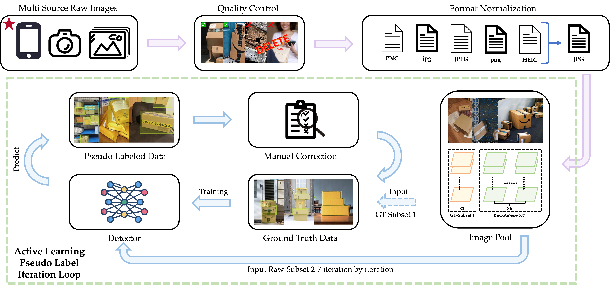
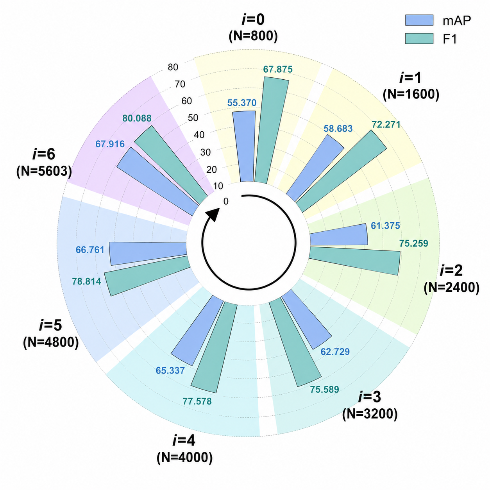
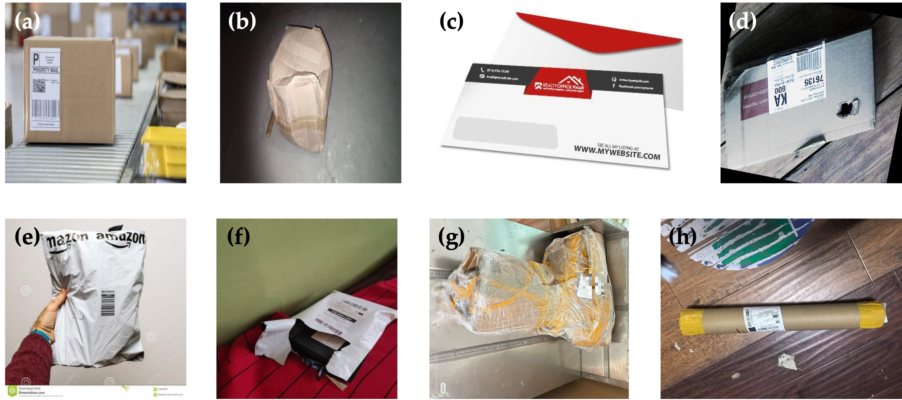
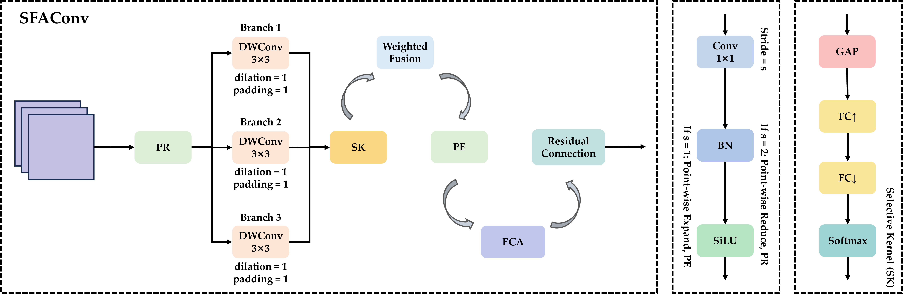
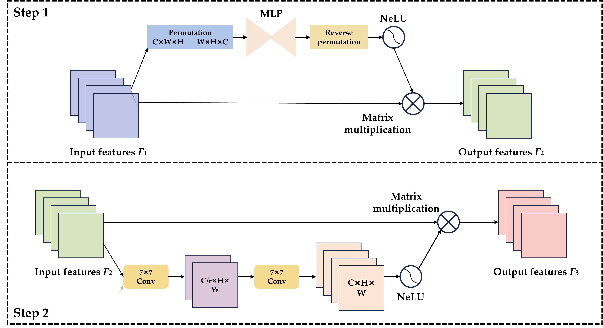
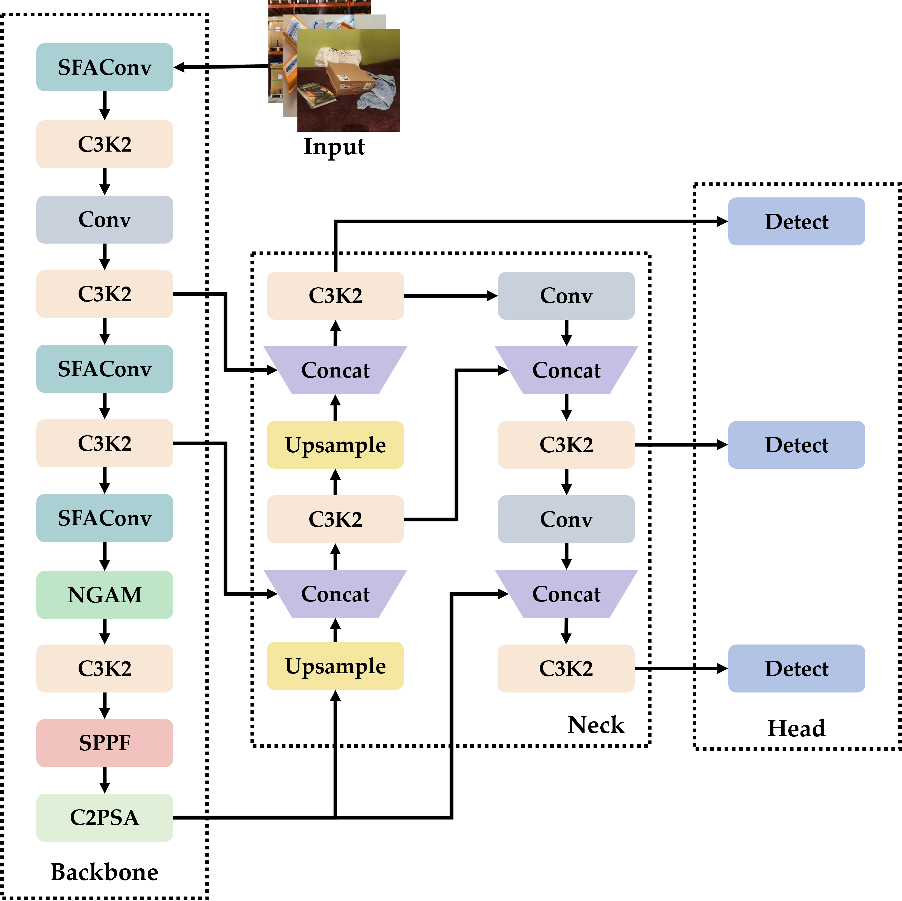
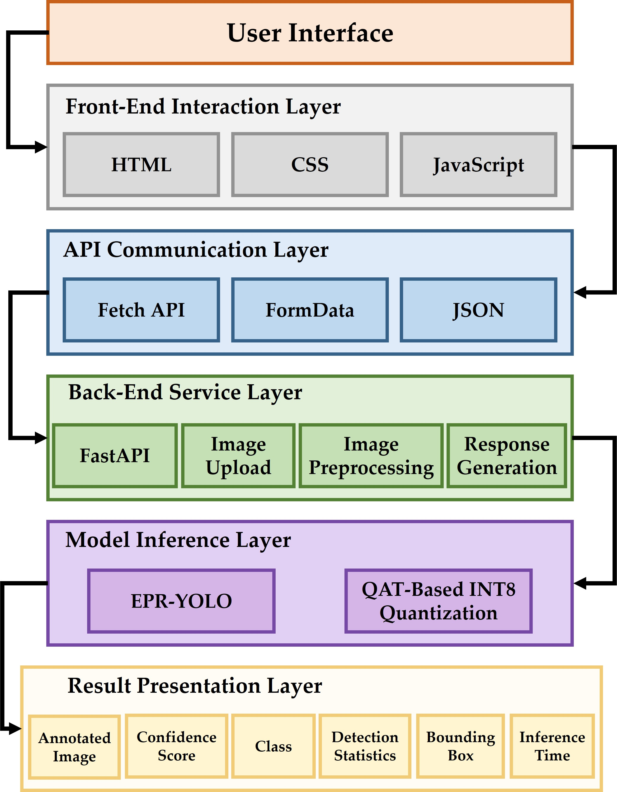
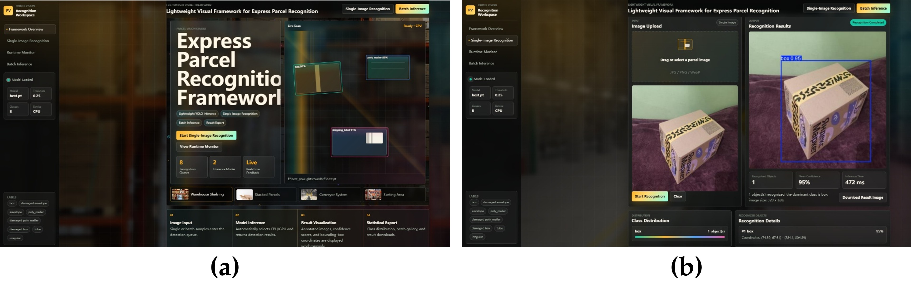

# EPR-YOLO

The repository is for the paper **“A Lightweight RGB Vision-Based Express Parcel Detection Framework with Active Learning and Quantization-Aware Training”**, including the EPR dataset and the implementation materials for reproducing the proposed framework.

The **Express Parcel Recognition (EPR) Dataset** has been publicly released on Kaggle. Source code and pretrained weights are being organized and will be released progressively.

## Dataset and Dataset Construction

We introduce the **Express Parcel Recognition (EPR) Dataset**, a dedicated RGB object-detection dataset for express-parcel recognition in complex logistics environments. The final dataset contains **5,603 images**, **8,274 annotated object instances**, and **8 parcel categories**, including both standard parcel types and damaged variants.

The EPR dataset is publicly available on Kaggle:

**[Express Parcel Recognition (EPR) Dataset on Kaggle](https://www.kaggle.com/datasets/ongkingu1/express-parcel-recognition-epr-dataset)**

The eight categories are: **box, damaged envelope, envelope, poly mailer, damaged poly mailer, damaged box, tube, and irregular parcel**.



**Fig. 1.** Workflow of the EPR dataset construction and Active Learning-based pseudo-label iteration strategy. Multi-source RGB images are collected and filtered through quality control, followed by unified re-annotation. An iterative pseudo-labeling procedure is then used to progressively expand the labeled dataset while reducing manual annotation effort.



**Fig. 2.** Evolution of mAP and F1 during the seven-round Active Learning-based pseudo-label iteration process. Here, *i* denotes the iteration index (*i* = 0–6), and *N* represents the number of labeled images available at each iteration.



**Fig. 3.** Representative samples of the eight parcel categories in the EPR dataset: (a) box; (b) damaged envelope; (c) envelope; (d) damaged box; (e) poly mailer; (f) damaged poly mailer; (g) irregular parcel; and (h) tube.

## EPR-YOLO Pipeline Overview

EPR-YOLO is developed from **YOLOv11s** for lightweight express-parcel detection. The proposed architecture introduces two customized modules: **Selective Multi-Scale Feature Aggregation Convolution (SFAConv)** and the **NeLU-enhanced Global Attention Mechanism (NGAM)**. SFAConv strengthens multi-scale feature extraction while controlling computational cost, whereas NGAM enhances global feature interaction and attention modeling in deeper backbone stages.



**Fig. 4.** Structural diagram of the proposed SFAConv module. Multi-branch depthwise convolution, selective-kernel weighted fusion, channel restoration, ECA, and residual learning are integrated to improve multi-scale feature representation with limited computational overhead.



**Fig. 5.** Structural diagram of the proposed NGAM module. NGAM is developed from the Global Attention Mechanism and incorporates the NeLU activation function to improve nonlinear feature transformation within channel and spatial attention modeling.



**Fig. 6.** Overall architecture of EPR-YOLO. SFAConv modules replace selected convolutional layers in the YOLOv11s backbone, while NGAM is introduced into a deeper backbone stage. The original multi-scale detection head is retained for parcel detection at different spatial scales.

## Quantization-Aware Deployment

Quantization-Aware Training (QAT) is further applied to EPR-YOLO for low-precision deployment. Fake quantization is introduced during training to simulate INT8 inference behavior while allowing the network to adapt its parameters to quantization effects.

The FP32 EPR-YOLO model achieves **71.654% mAP50**, with **20.9 GFLOPs** and **8.53 M parameters**. Compared with YOLOv11s, the proposed model reduces the parameter count by approximately **9.5%** and computational complexity by approximately **3.2%**. After QAT, the model size is reduced from **19.2 MB to 11.9 MB**, corresponding to an approximately **38.0% reduction**, while retaining most of the detection performance of the floating-point model.

## Web-Based Detection Application

A Web-based detection application is developed to demonstrate the application-level integration of the proposed framework. The system adopts a native **HTML/CSS/JavaScript** front end and a **FastAPI** back end, and supports image upload, preprocessing, model inference, result generation, and interactive visualization.



**Fig. 7.** Architecture of the Web-based express-parcel detection application. The system consists of the front-end interaction layer, API communication layer, back-end service layer, model inference layer, and result presentation layer.



**Fig. 8.** Web interface of the EPR-YOLO detection system: (a) framework overview and recognition workspace; (b) single-image recognition interface with detection visualization, confidence score, inference time, class distribution, and recognition details.

## EPR Dataset

The complete EPR dataset is available from Kaggle:

**[Download / View the EPR Dataset](https://www.kaggle.com/datasets/ongkingu1/express-parcel-recognition-epr-dataset)**

| Dataset property | Description |
| --- | --- |
| Images | 5,603 |
| Object instances | 8,274 |
| Classes | 8 |
| Image modality | RGB |
| Detection input size | 640 × 640 |
| Annotation task | Object detection |

## Pretrained Weights

The pretrained weights of **EPR-YOLO (FP32)** and **QAT-EPR-YOLO (INT8)** will be provided in the `weights/` directory.

- `EPR-YOLO`: optimized floating-point model trained on the EPR dataset — **Coming soon**.
- `QAT-EPR-YOLO`: quantization-aware INT8 model — **Coming soon**.

These weights will be provided for inference, evaluation, visualization, and further research on parcel recognition and logistics vision systems.

## Source Code

The source code is currently being organized. The following components will be released progressively:

- Active Learning-based pseudo-label iteration
- SFAConv implementation
- NGAM implementation
- EPR-YOLO model configuration
- Training and evaluation pipeline
- Quantization-Aware Training and INT8 deployment
- FastAPI-based Web application

The corresponding repository directories currently contain placeholder files marked **Coming soon**.

## Repository Structure

```text
EPR-YOLO/
├── assets/                  # Figures from the paper
├── active_learning/         # Active Learning and pseudo-label iteration
├── models/
│   ├── sfaconv/             # SFAConv implementation
│   └── ngam/                # NGAM implementation
├── qat/                     # Quantization-Aware Training
├── train/                   # Training pipeline
├── evaluate/                # Model evaluation
├── web_app/                 # FastAPI Web application
├── configs/                 # Model and training configurations
├── weights/                 # Pretrained model weights
├── LICENSE
└── README.md
```

## Getting Start

Detailed installation, training, evaluation, quantization, and Web deployment instructions are **coming soon** and will be released together with the source code.

## Citation

If you use the EPR dataset, EPR-YOLO, or materials from this repository in your research, please cite the associated paper. The final bibliographic information will be updated after publication.

```bibtex
@article{wu2026epryolo,
  title   = {A Lightweight RGB Vision-Based Express Parcel Detection Framework with Active Learning and Quantization-Aware Deployment},
  author  = {Wu, An-Qi and Guo, Fan and Yang, Weijun and Wang, Rui-Feng and Hu, Pingfan},
  year    = {2026},
  note    = {Manuscript under review}
}
```

## License

License information will be updated together with the public source-code release.
